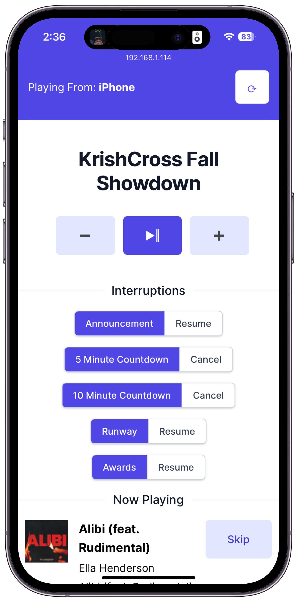

# Showdown DJ
A locally-hosted mobile web-app for controlling the playlists and audio effects for the KrishCross Fall Showdown.

## Instructions
This app runs on your local laptop, but is controlled via your phone. It will control whatever Spotify device in your house is playing music. Here's how to get it running:

1. Create an "app" in the [Spotify developer portal](https://developer.spotify.com/dashboard). 
- In the "Basic Information" section, note the client ID and client secret that it gives you. 
- Add some local callback URLs (example: `http://192.168.1.114:3000/auth/spotify/callback` and `http://localhost:3000/auth/spotify/callback`)
2. Create a new encrypted credentials file (`EDITOR="code --wait" bin/rails credentials:edit`) and add your ID and secret from Spotify. See `config/credentials.yml.sample` for an example of the YAML structure that the app expects.
3. Start the app on your laptop with `foreman start -f Procfile.dev`
4. On your phone, browse to the local IP address of your laptop (example: `http://192.168.1.62:3000`)

## Dependencies 
This app uses the [rspotify gem](https://github.com/guilhermesad/rspotify) to make authenticating and communicating with Spotify a bit simpler. 
